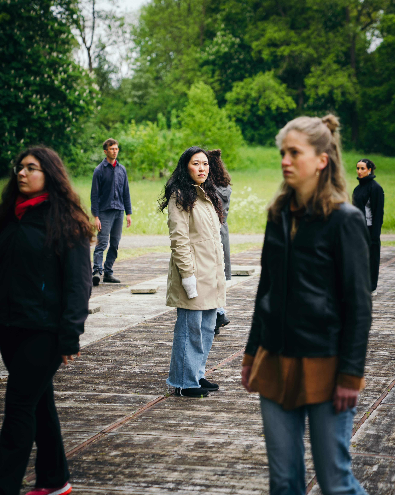
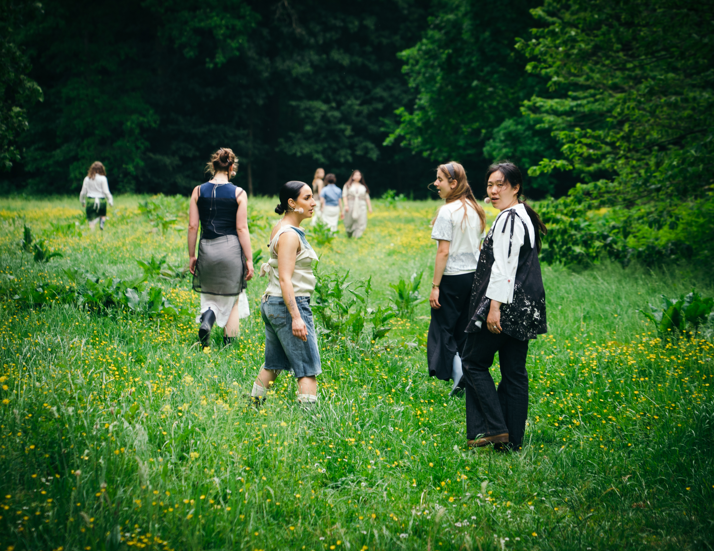
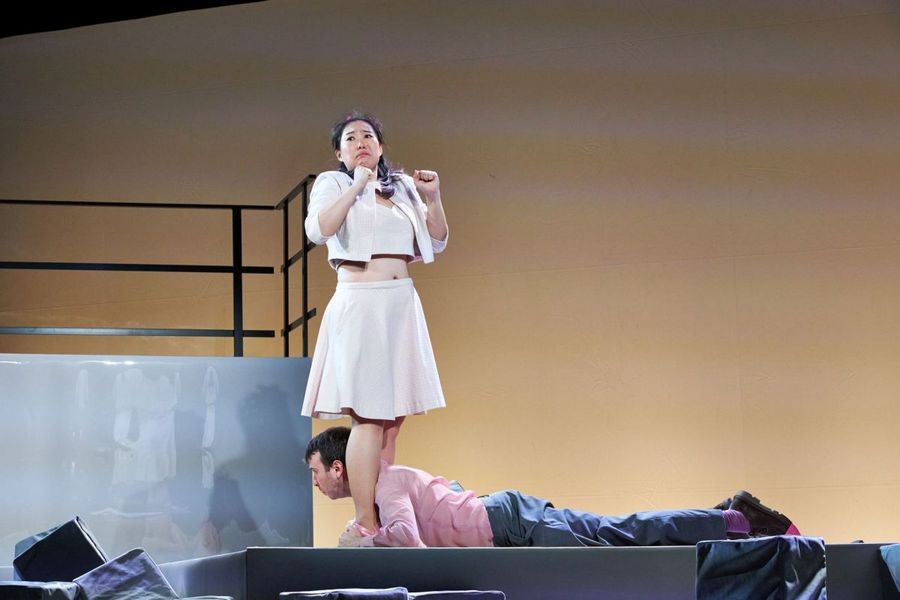
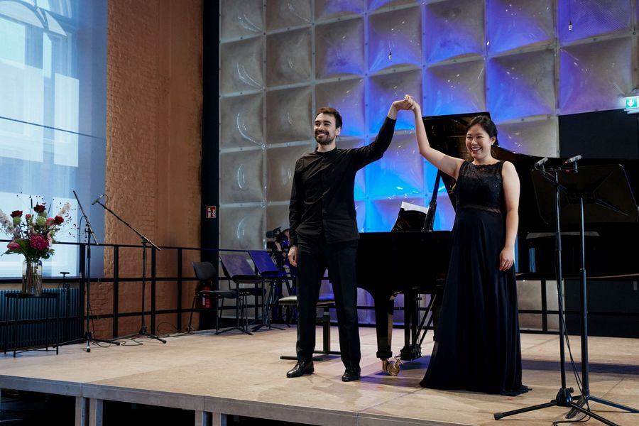

<!doctype html>
<html lang="en">
<head>
<meta charset="utf-8">
<meta name="viewport" content="width=device-width, initial-scale=1">
<title>Youngin Lee — Mezzo-Soprano</title>
<meta name="description" content="Youngin Lee — Korean mezzo-soprano based in Rotterdam, active in opera, concert repertoire and professional ensemble singing across Europe.">

</head>
<body>
<header class="nav">
<a class="brand" href="#top">Youngin Lee</a>

<nav class="menu"><a href="#bio" data-i18n="navBio">Biography</a><a href="#agenda" data-i18n="navAgenda">Agenda</a><a href="#media" data-i18n="navMedia">Media</a><a href="#contact" data-i18n="navContact">Contact</a></nav>

<button class="lang-btn active" data-lang="en">EN</button><button class="lang-btn" data-lang="nl">NL</button><button class="lang-btn" data-lang="ko">KO</button>

</header>
<main id="top">
<section class="hero">

Mezzo-Soprano · Rotterdam / Europe

<h1>Youngin Lee</h1>

mezzo-soprano

Seoul · Berlin · Vienna · Rotterdam

Next

An Elegy

NKK NXT · Muziekgebouw aan ’t IJ · Amsterdam
<a class="next-link" target="_blank" rel="noopener" href="https://www.muziekgebouw.nl/en/agenda/an-elegy-fk9j" data-i18n="tickets">Tickets ↗</a>

13 SEP 2026 20:15

</section>

<section class="section" id="bio">

01 / Biography

<h2 data-i18n="bioTitle">Youngin Lee</h2>

Youngin Lee is a Korean mezzo-soprano based in Rotterdam, active in opera, concert repertoire and professional ensemble singing across the Netherlands, Germany and Austria.

Youngin Lee began her musical education at Seoul Arts High School and continued her studies at Ewha Womans University in Seoul, earning a Bachelor's degree in Vocal Performance and a Master's degree in Musicology. She subsequently pursued a Master’s degree in Opera at the Hochschule für Musik Hanns Eisler Berlin, studying under KS. Dr. Prof. Ewa Wolak, and was a recipient of the prestigious Deutschlandstipendium in the 2022/23 season.

Her operatic work includes Dorabella in <em>Così fan tutte</em>, Dido in <em>Dido and Aeneas</em>, Hänsel in <em>Hänsel und Gretel</em>, L’enfant in <em>L’enfant et les sortilèges</em>, Cherubino in <em>Le nozze di Figaro</em>, and Ava in the world premiere of <em>D:\FACED</em> at Deutsche Oper Berlin’s Tischlerei. Her concert repertoire includes Mozart’s <em>Great Mass in C minor</em> and Pergolesi’s <em>Missa S. Emidio</em>, among other works for alto soloist.

She has appeared at Deutsche Oper Berlin, Varaždin National Theatre, Musikverein Vienna, Borromäus Hall, Roter Salon and Mozarthaus Vienna, and at festivals including the Vienna Opera Festival, Varaždin Baroque Evenings and Schumann Fest Zwickau. Her professional ensemble experience includes the Wiener Staatsoper Choir Academy, Staatsoper Hamburg, NKK NXT, Dutch National Opera & Ballet and, from the 2026/27 season, Groot Omroepkoor as a freelance first alto.

Her artistic development has been shaped by masterclasses with Thomas Quasthoff, Giancarlo del Monaco, Victoria Loukianetz, Mitsuko Shirai, Janet Williams and Peter Berne. She has also received the Platinum Award at the Global Young Musicians Competition and First Prize at the Gold International Classical Music Competition, both in 2025.

Youngin Lee currently resides in Rotterdam and is active as a concert and ensemble singer on the international stage, while also participating in cultural projects connecting Korean heritage with the Dutch cultural landscape.

<h3 data-i18n="education">Education</h3>
<button class="tab active" onclick="eduTab('bachelor',this)" data-i18n="bachelor">Bachelor</button><button class="tab" onclick="eduTab('master',this)" data-i18n="master">Master</button>

<strong>Ewha Womans University</strong>B.M. Voice / Vocal Performance · Seoul

<strong>HfM Hanns Eisler Berlin</strong>M.M. Opera · KS Dr. Prof. Ewa Wolak

<strong>Ewha Womans University</strong>M.M. Musicology · Prof. Mija Park · Seoul

<h3 data-i18n="recognition">Selected Recognition</h3>
<strong>Platinum Award</strong>Global Young Musicians Competition · 2025

<strong>1st Prize</strong>Gold International Classical Music Competition · 2025

<strong>Deutschlandstipendium</strong>HfM Hanns Eisler Berlin · 2022/23

<h3 data-i18n="repertoire">Opera Roles</h3>

<strong>Dorabella</strong><em>Così fan tutte</em> · W. A. Mozart

<strong>Dido</strong><em>Dido and Aeneas</em> · H. Purcell

<strong>Hänsel</strong><em>Hänsel und Gretel</em> · E. Humperdinck

<strong>Ava</strong><em>D:\FACED</em> · World Premiere · Deutsche Oper Berlin

<strong>L’enfant</strong><em>L’enfant et les sortilèges</em> · M. Ravel

<strong>Cherubino</strong><em>Le nozze di Figaro</em> · W. A. Mozart

<strong>Meg</strong><em>Little Women</em>

<strong>Charlotte</strong><em>Werther</em> · J. Massenet

<strong>Idamante</strong><em>Idomeneo</em> · W. A. Mozart

<strong>3. Dame</strong><em>Die Zauberflöte</em> · W. A. Mozart

</section>

<section class="section" id="agenda">

02 / Agenda

<h2 data-i18n="agendaTitle">Agenda <em>& Archive</em></h2>

<button class="tab active" onclick="modeTab('agenda',this)" data-i18n="agendaTab">Agenda</button><button class="tab" onclick="modeTab('archive',this)" data-i18n="archiveTab">Archive</button>

<button class="year-btn active" onclick="yearTab('agenda-2026',this,'agenda-years')">2026</button><button class="year-btn" onclick="yearTab('agenda-2027',this,'agenda-years')">2027</button>

13 SEP 2026

An Elegy

Mees Vervuurt · Studio Vacuüm · NKK NXT
<a class="ticket" target="_blank" rel="noopener" href="https://www.muziekgebouw.nl/en/agenda/an-elegy-fk9j" data-i18n="tickets">Tickets ↗</a>

Muziekgebouw aan ’t IJ Grote Zaal · Amsterdam

06 NOV 2026

Rossini — Stabat Mater

Groot Omroepkoor · Radio Filharmonisch Orkest · Edward Gardner
<a class="ticket" target="_blank" rel="noopener" href="https://www.tivolivredenburg.nl/agenda/76133592/stabat-mater-van-rossini-06-11-2026" data-i18n="tickets">Tickets ↗</a>

TivoliVredenburg Grote Zaal · Utrecht

08 NOV 2026

Rossini — Stabat Mater

Groot Omroepkoor · Radio Filharmonisch Orkest · Edward Gardner
<a class="ticket" target="_blank" rel="noopener" href="https://www.concertgebouw.nl/concerten/37473493-rossinis-stabat-mater-met-het-groot-omroepkoor" data-i18n="tickets">Tickets ↗</a>

Het Concertgebouw Grote Zaal · Amsterdam

21 NOV 2026

Bertin — Fausto

Dutch premiere · Radio Filharmonisch Orkest · Groot Omroepkoor · Giulio Cilona
<a class="ticket" target="_blank" rel="noopener" href="https://www.concertgebouw.nl/concerten/45743708-fausto-een-vergeten-opera" data-i18n="tickets">Tickets ↗</a>

Het Concertgebouw Grote Zaal · Amsterdam

18 DEC 2026

Mozart — Coronation Mass, K. 317

Groot Omroepkoor · AVROTROS Christmas Concert
<a class="ticket" target="_blank" rel="noopener" href="https://www.tivolivredenburg.nl/agenda/39029765/avrotros-kerstconcert-mozarts-kronungsmesse-18-12-2026" data-i18n="tickets">Tickets ↗</a>

TivoliVredenburg Grote Zaal · Utrecht

10 MAR 2027

Beethoven — Missa solemnis

Concertgebouworkest · Groot Omroepkoor · Klaus Mäkelä
<a class="ticket" target="_blank" rel="noopener" href="https://www.concertgebouw.nl/concerten/45900755-concertgebouw-orchestra-klaus-makela-beethovens-missa-solemnis" data-i18n="tickets">Tickets ↗</a>

Het Concertgebouw Grote Zaal · Amsterdam

11 MAR 2027

Beethoven — Missa solemnis

Concertgebouworkest · Groot Omroepkoor · Klaus Mäkelä
<a class="ticket" target="_blank" rel="noopener" href="https://www.bozar.be/en/calendar/koninklijk-concertgebouworkest-makela-0" data-i18n="tickets">Tickets ↗</a>

Bozar · Henry Le Boeuf Hall Brussels

12 MAR 2027

Beethoven — Missa solemnis

Concertgebouworkest · Groot Omroepkoor · Klaus Mäkelä
<a class="ticket" target="_blank" rel="noopener" href="https://www.concertgebouw.nl/concerten/45900875-concertgebouw-orchestra-klaus-makela-beethovens-missa-solemnis" data-i18n="tickets">Tickets ↗</a>

Het Concertgebouw Grote Zaal · Amsterdam

14 MAR 2027

Beethoven — Missa solemnis

Concertgebouworkest · Groot Omroepkoor · Klaus Mäkelä
<a class="ticket" target="_blank" rel="noopener" href="https://www.concertgebouw.nl/concerten/45900875-concertgebouw-orchestra-klaus-makela-beethovens-missa-solemnis" data-i18n="tickets">Tickets ↗</a>

Het Concertgebouw Grote Zaal · Amsterdam

22 MAR 2027

Beethoven — Missa solemnis

Royal Concertgebouw Orchestra · Netherlands Radio Choir · Klaus Mäkelä
<a class="ticket" target="_blank" rel="noopener" href="https://www.festspielhaus.de/en/program/beethoven-missa-solemnis/93" data-i18n="tickets">Tickets ↗</a>

Festspielhaus Baden-Baden Baden-Baden

<button class="year-btn active" onclick="yearTab('archive-2026',this,'archive-years')">2026</button><button class="year-btn" onclick="yearTab('archive-2025',this,'archive-years')">2025</button><button class="year-btn" onclick="yearTab('archive-2024',this,'archive-years')">2024</button><button class="year-btn" onclick="yearTab('archive-2023',this,'archive-years')">2023</button><button class="year-btn" onclick="yearTab('archive-2022',this,'archive-years')">2022</button>

26 AUG 2026

Jan Janszn. Weltevree / Park Yeon Commemoration

Commemorative cultural event

De Rijp Netherlands

12–21 JUN 2026

An Elegy

Oerol Festival · NKK NXT · multiple performances

Arjensdune West Terschelling

30 MAY 2026

An Elegy

O. Festival · NKK NXT

Kralingse Bos Rotterdam

31 MAY 2026

An Elegy

O. Festival · NKK NXT

Kralingse Bos Rotterdam

23 MAY 2026

An Elegy

Oranjewoud Festival · NKK NXT · Mees Vervuurt

Roodbaard Garden, Oranjestein Oranjewoud

12 DEC 2025

Performance Honoring Korean War Veterans

Embassy of the Republic of Korea

The Hague Netherlands

07 JUL 2025

Yi Jun Commemoration

Yi Jun Peace Museum

The Hague Netherlands

12 DEC 2025

The Netherlands Korean Year-End Concert

Korean cultural concert

Amsterdam Netherlands

08 AUG 2024

Jan Janszn. Weltevree / Park Yeon Commemoration

Commemorative concert

Grote Kerk De Rijp, Alkmaar

12 DEC 2024

The Netherlands Korean Year-End Concert

Korean cultural concert

Postillion Hotel Amsterdam

12 DEC 2023

Opera Aria Gala

Opera concert

Roter Salon Vienna

07 JUL 2023

Felix Mendelssohn — 12 Lieder, Op. 8

HfM Hanns Eisler Berlin

Berlin Germany

06 JUN 2022

R. Schumann — Frauenliebe und Leben, Op. 42

Schumann Fest Zwickau

Zwickau Germany

04 APR 2022

I. Lilien — Veronica: 4 Lieder

HfM Hanns Eisler Berlin

Berlin Germany

<h3 data-i18n="operaArchive">Opera Archive</h3>

<button class="year-btn active" onclick="yearTab('opera-2023',this,'opera-years')">2023</button><button class="year-btn" onclick="yearTab('opera-2022',this,'opera-years')">2022</button>

OCT / 2023

Così fan tutte — Dorabella

HfM Hanns Eisler Berlin · Zsófia Geréb · Peter Meiser

Berlin Germany

OCT / 2023

L’enfant et les sortilèges — L’enfant

HfM Hanns Eisler Berlin · Rebekah Rota · Peter Meiser / Byron Knutson

Berlin Germany

AUG–SEP / 2023

Dido and Aeneas — Dido

Varaždin National Theatre · Varaždin Baroque Evenings

Varaždin Croatia

APR / 2023

D:\FACED — Ava

Neue Szenen VI · World Premiere · Deutsche Oper Berlin Tischlerei · Leah Willeke

Berlin Germany

JAN / 2023

Hänsel und Gretel — Hänsel

Vienna Opera Festival · Wiener Festspiele · Toby Purser

Musikverein Vienna

AUG / 2022

Le nozze di Figaro — Cherubino

HNK Varaždin · Taro Morikawa · Darijan Ivezić

Varaždin Croatia

</section>

<section class="section" id="media">

03 / Media

<h2 data-i18n="mediaTitle">Watch. Listen. See.</h2>
The final version can place your strongest performance videos, audio recordings and professional photography here. The homepage is designed to work beautifully with a single portrait photograph.

Featured Video · coming soon

Photography

  

    
  

  

    
  

  

    
  

  

    
  

  

    
  

Press Kit

</section>

<section class="contact" id="contact">

04 / Contact

<h2 data-i18n="contactTitle">Let's work together.</h2>
<form class="form" onsubmit="sendMail(event)">
<label data-i18n="name">Name</label><input id="name" required>

<label data-i18n="email">Email</label><input id="email" type="email" required>

<label data-i18n="subject">Subject</label><input id="subject" required>

<label data-i18n="message">Message</label><textarea id="message" required></textarea>
<button class="send" type="submit" data-i18n="send">Send message</button></form>

</section>
</main>
<footer>Youngin Lee · Mezzo-Soprano© 2026</footer>

</body>
</html>
